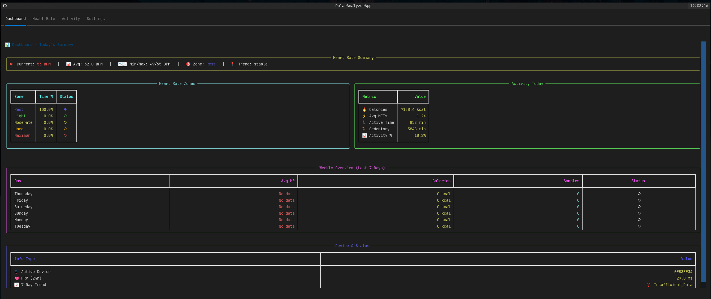

# Polar Loop Data Analyzer

<div align="center">
  
</div>

A Python TUI (Terminal User Interface) application for analyzing Polar Loop fitness band data with heart rate graphics, trends, and comprehensive activity statistics. Built with clean architecture principles and modern Python practices.

## ✨ Features

### 📊 Dashboard
- **Smart Summary View**: Clean tabular interface with key metrics
- **Heart Rate Zones**: Time distribution across different intensity zones
- **Activity Overview**: Calories, METs, active/sedentary time tracking
- **Weekly Comparison**: 7-day trend analysis with status indicators
- **Device Status**: Connected devices, HRV, and system information

### ❤️ Heart Rate Analysis
- **24-Hour Trend Graphs**: Visual heart rate patterns throughout the day
- **Zone Distribution Charts**: Time spent in Rest, Light, Moderate, Hard, Maximum zones
- **Real-time Statistics**: Current HR, averages, min/max values
- **Hourly Breakdown**: Statistics by time periods (Night, Morning, Afternoon, Evening)
- **Heart Rate Variability**: HRV analysis and trend assessments

### 🔄 Incremental Data Import
- **Smart File Tracking**: SHA256 hash-based duplicate detection
- **Automatic Processing**: Only imports new or modified files
- **Error Resilience**: Failed imports don't block other files
- **Import History**: Complete audit trail of all data imports
- **Force Reimport**: Option to manually reprocess specific files

### 🏗️ Architecture

Built following **Clean Architecture** principles with clear separation of concerns:

#### Design Patterns Implemented
1. **Repository Pattern**: Abstracts data access (JSON reading and SQLite persistence)
2. **Service Layer**: Encapsulates business logic for heart rate and statistics analysis
3. **Facade Pattern**: Provides simplified API for complex subsystem operations
4. **Domain Models**: Clean domain entities with Pydantic validation

#### Project Structure
```
src/
├── domain/              # Domain models and value objects
│   ├── models.py       # HeartRate, Activity, PPI data models
│   └── value_objects.py # Heart rate zones, time ranges
├── repository/          # Data access layer
│   ├── base.py         # Abstract repository interfaces
│   ├── json_repository.py    # JSON file readers
│   ├── sqlite_repository.py  # SQLite persistence
│   └── file_import_repository.py # Import tracking
├── service/             # Business logic layer
│   ├── data_import_service.py   # Data import & transformation
│   ├── heart_rate_service.py    # HR analysis & trends
│   └── statistics_service.py    # Metrics calculation
├── infrastructure/      # Database & configuration
│   ├── database.py     # SQLite schema & connection
│   └── config.py       # Application configuration
├── presentation/        # TUI layer
│   ├── app.py          # Main application
│   ├── views/          # Dashboard, heart rate views
│   └── components/     # Reusable UI components
├── facade.py           # Simplified API facade
└── main.py            # Application entry point
```

## 🚀 Installation

### Prerequisites
- Python 3.9 or higher
- Poetry (recommended) or pip

### Using Poetry (Recommended)
1. Install Poetry:
```bash
curl -sSL https://install.python-poetry.org | python3 -
```

2. Clone and install:
```bash
git clone <repository-url>
cd polar_loop
poetry install
```

### Using pip
```bash
pip install -r requirements.txt  # If requirements.txt exists
# Or install dependencies manually:
pip install textual rich plotext sqlalchemy pydantic
```

## 📱 Usage

### 1. Export Your Polar Loop Data
- Log into your Polar Flow account
- Export your data as JSON files
- Place all `.json` files in the `loop_data/` directory

### 2. Run the Application
```bash
# Using Poetry
poetry run polar-analyzer

# Or directly
poetry run python -m src.main

# Using pip
python -m src.main
```

### 3. Navigate the Interface
- **Dashboard Tab**: Overview and summary tables
- **Heart Rate Tab**: Detailed graphs and analysis
- **Activity Tab**: Activity-specific metrics (future enhancement)
- **Settings Tab**: Device and configuration information

## ⌨️ Keyboard Shortcuts

| Key | Action |
|-----|--------|
| `q` | Quit application |
| `r` | Refresh dashboard & check for new files |
| `d` | Toggle dark/light mode |
| `Tab` | Switch between tabs |
| `Shift+Tab` | Switch tabs in reverse |

## 🔄 Data Processing

### Import Workflow
1. **Detection**: Scans `loop_data/` for JSON files
2. **Validation**: Calculates SHA256 hashes to detect changes
3. **Processing**: Parses JSON into validated domain models
4. **Storage**: Persists data to normalized SQLite tables
5. **Analysis**: Services provide insights via repository queries

### Supported File Types
- `247ohr_*.json` - Heart rate data
- `activity-*.json` - Activity and METs data
- `ppi_samples_*.json` - Heart rate variability data
- `products-devices*.json` - Device information
- Other Polar Flow export files

### Incremental Updates
- ✅ **Smart Detection**: Only new/modified files are processed
- ✅ **Fast Startup**: Subsequent runs skip existing data
- ✅ **Live Updates**: Press `r` to check for new files
- ✅ **Error Recovery**: Failed imports don't affect other files

## 🛠️ Development

### Code Quality
```bash
# Format code
poetry run black src/

# Type checking
poetry run mypy src/

# Linting
poetry run ruff check src/
```

### Testing
```bash
# Run tests
poetry run pytest

# Coverage
poetry run pytest --cov=src/
```

### Project Standards
- **Python 3.9+**: Modern Python features
- **Type Hints**: Full type annotation coverage
- **Clean Architecture**: Domain-driven design
- **SOLID Principles**: Single responsibility, dependency inversion
- **Error Handling**: Comprehensive exception management

## 📦 Dependencies

### Core Dependencies
- **textual** `^0.47.0` - Modern TUI framework
- **rich** `^13.7.0` - Terminal formatting and styling
- **plotext** `^5.2.8` - Terminal plotting library
- **sqlalchemy** `^2.0.23` - Database ORM
- **pydantic** `^2.5.0` - Data validation and models

### Development Dependencies
- **pytest** `^7.4.3` - Testing framework
- **black** `^23.11.0` - Code formatter
- **mypy** `^1.7.0` - Static type checker
- **ruff** `^0.1.6` - Fast Python linter

## 🤝 Contributing

We welcome contributions from the community! Whether you're interested in adding new features, fixing bugs, improving documentation, or enhancing the user experience, your help is appreciated.

### Ways to Contribute

- 🐛 **Report Bugs**: Found an issue? Create a detailed bug report
- 💡 **Suggest Features**: Have ideas for new functionality? Open a feature request
- 📖 **Improve Documentation**: Help make the docs clearer and more comprehensive
- 🧪 **Add Tests**: Improve test coverage and reliability
- 🎨 **Enhance UI/UX**: Make the terminal interface more intuitive
- 🏗️ **Architecture**: Help refine the clean architecture implementation
- 📊 **Analytics**: Add new metrics and visualization capabilities

### Getting Started

1. **Fork the repository**
2. **Create a feature branch**: `git checkout -b feature/amazing-feature`
3. **Make your changes**: Follow the coding standards and architecture patterns
4. **Add tests**: Ensure your changes are well-tested
5. **Update documentation**: Keep docs current with your changes
6. **Submit a pull request**: Describe your changes and their benefits

### Development Environment
```bash
# Clone your fork
git clone https://github.com/neatnettech/polar-loop-analyzer.git
cd polar-loop-analyzer

# Set up development environment
poetry install --with dev

# Run tests to ensure everything works
poetry run pytest

# Start coding! 🚀
```

### Code Style
- Follow **PEP 8** guidelines
- Use **type hints** throughout
- Write **docstrings** for public methods
- Maintain **clean architecture** patterns
- Add **unit tests** for new functionality

### Community

- 💬 **Discussions**: Share ideas and ask questions in GitHub Discussions
- 🐛 **Issues**: Report bugs or request features via GitHub Issues
- 📧 **Contact**: Reach out to maintainers for collaboration opportunities
- ⭐ **Star the Repo**: Show your support and help others discover the project

Together, let's build the best Polar Loop data analysis tool for the fitness community! 🏃‍♂️❤️📊
